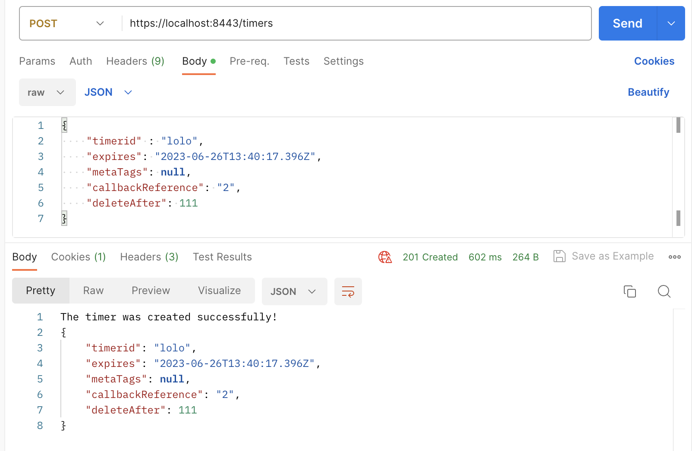
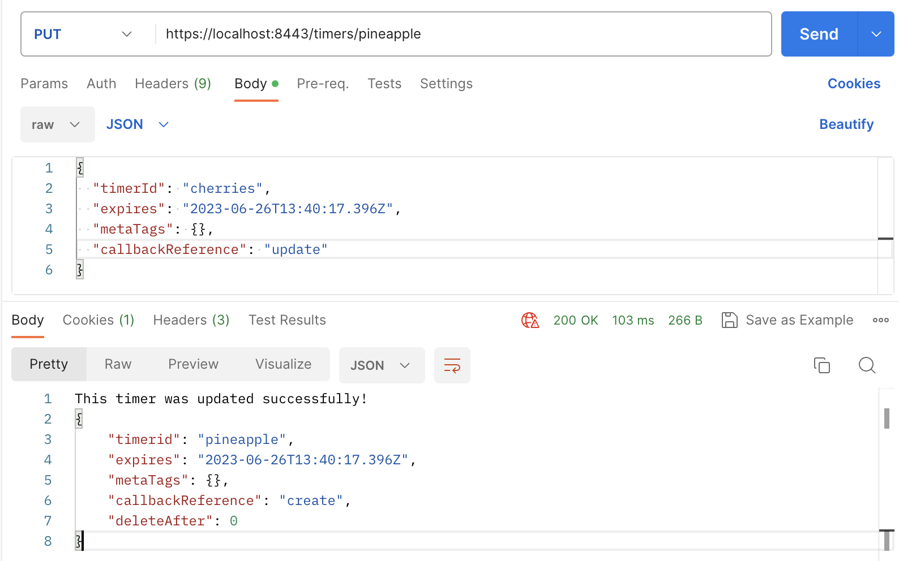
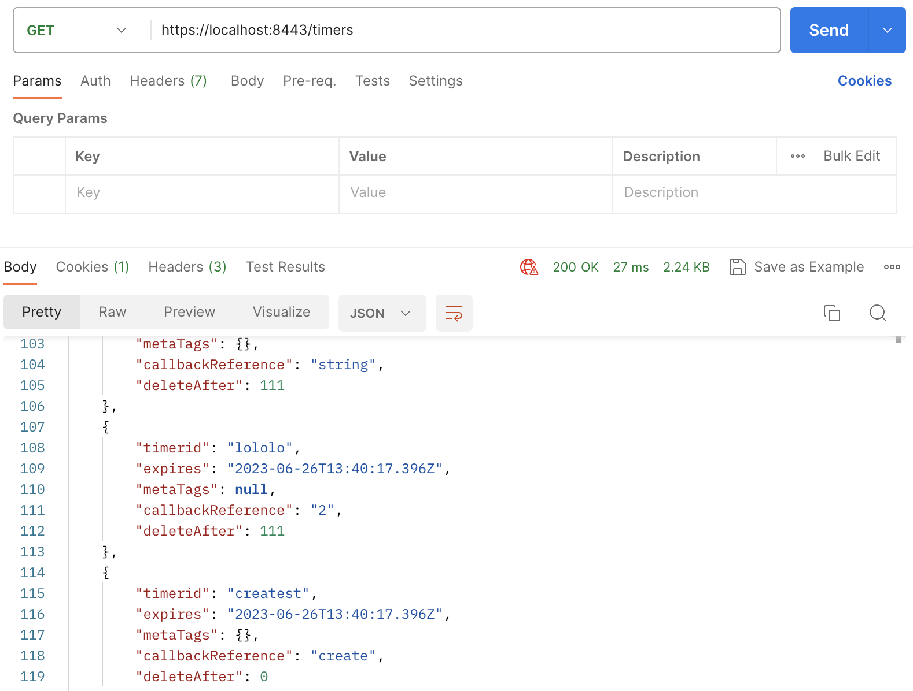

# nUDSF Timer API
The repo shed lights on a Go API that queries timers from UDSF network function using MangoDB database. It allows you to create, update, and retrieve timers using HTTP requests.

### Prerequisites
- Go installed (1.20)
- [MongoDB Atlas](https://www.mongodb.com/atlas/database) account
- CA certificate and key (.pem) 

### Installation
1- After making sure Go is installed, you can create a new project directory where to clone the repository:
```shell
git clone https://github.com/KaoutarChiboub/nUDSF.git
cd nUDFS
```
2- Right after, you need to download Go dependencies and packages:
```shell
go mod download
```
3- In this example, we are using a NoSQL database which is MongoDB. Particularily, we will use the MongoDB cloud product a.k.a MongoDB Atlas. To do so, we assume you already have an account there (which is easy to do on their website) to create a new cluster where your DB is located. Please note the URI and your username password, provided after finishing the cluster creation, that will be used to connect to your database.

4- In the `.env` file, modify it by inserting your **MongoDB username password** and the path to your **CA certif** and **Private Key** in case you want to ensure an HTTPS/TLS connection. To make things simple, we used local self-signed certificate created by `mkcert` [framework](https://github.com/FiloSottile/mkcert) in Go.

Another thing, go to `main.go` file and modify this line (32) to have your MongoDB username and cluster name/id provided by MongoDB when you try to connect to your cluster.
```go
var uri = fmt.Sprintf("mongodb+srv://<username>:%s@<your_cluster_id_string>/?retryWrites=true&w=majority", pswd)
```

5- Now, it is time to build the REST API application.
```shell
go build
```

### Start the API
After making sure your MongoDB database/cluster is set and created, and all the modifications are made correctly, you can run the application:
```shell
go run main.go
```
By default, the server will listen on localhost:8443 for HTTPS requests. And your should see that the connection to your DB is successfuly done.
__If needed, in the code, you can modify the server to use simple HTTP without configuring TLS.__

### Endpoints and testing
For testing our API, we used a famous API platform called [Postman](https://www.postman.com/). As well as `cURL` requests for terminal-engaged testing. We will show you how to do some testing with both methods in the coming sections below.
#### POST
Create a new timer by sending a POST request to the /timers endpoint. The timer details should be included in the request body as JSON. The response will contain the created timer with a message stating the success of the request. **The `timerid` must be unique**. The type of inputs should be respected to avoid bad requests. And if the timerid is not found in db, it will return an error explaining that.
With cURL, it should be requested like the following:
```shell
curl -X 'POST' 'https://localhost:8443/timers' -H 'accept: */*' -H 'Content-Type: application/json' -d '{ "timerid": "pineapple", "expires": "2023-06-26T13:40:17.396Z", "metaTags": {}, "callbackReference": "create", "deleteAfter": 0}'
```
- With Postman, it looks more graphically clear:


#### PUT
Update an existing timer by sending a PUT request to the /timers/{id} endpoint, where {id} is the ID of the timer you want to update. Include the updated timer details in the request body as JSON with the constraint **of not modifying the `deleteAfter` input** or just omit that last input, otherwise it will return `401 Unauthorized`.
```shell
curl -X 'PUT' 'https://localhost:8443/timers/pineapple' -H 'accept: */*' -H 'Content-Type: application/json' -d '{ "timerid": "cherries", "expires": "2023-06-26T13:40:17.396Z", "metaTags": {}, "callbackReference": "update"}'
```
In case of unauthorized requestm you get the following error message:
```shell 
Unauthorized: Modifying deleteAfter field of the last entry is not allowed. Please retry without it!
```
- Same in Postman:


#### GET
Retrieve all timers by sending a GET request to the /timers endpoint. The response will contain an array of all timers stored in the database. If no timer is found, a `404` response will be returned.
```shell
curl -X 'GET' 'https://localhost:8443/timers'
```
And with Postman:


### API unit test and Request validation
We have provided a unit testing file for our application in `main_test.go` which you can run using the command `go test` since Go will automatically detect all your test files and run them. 

You can also notice request validation setup inside our program to verify some input fields. It is to be extended in case of having more restricted conditions on the request body.
